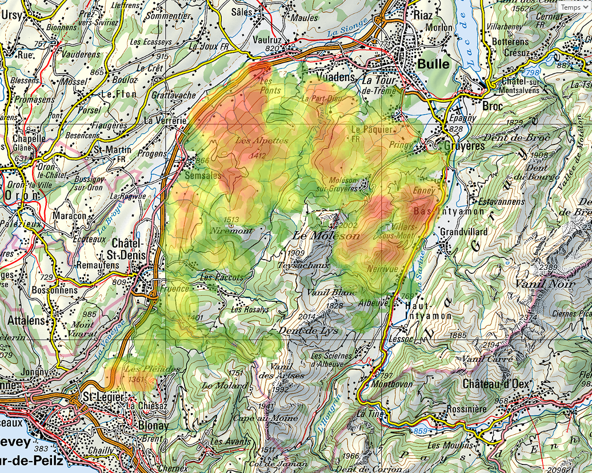
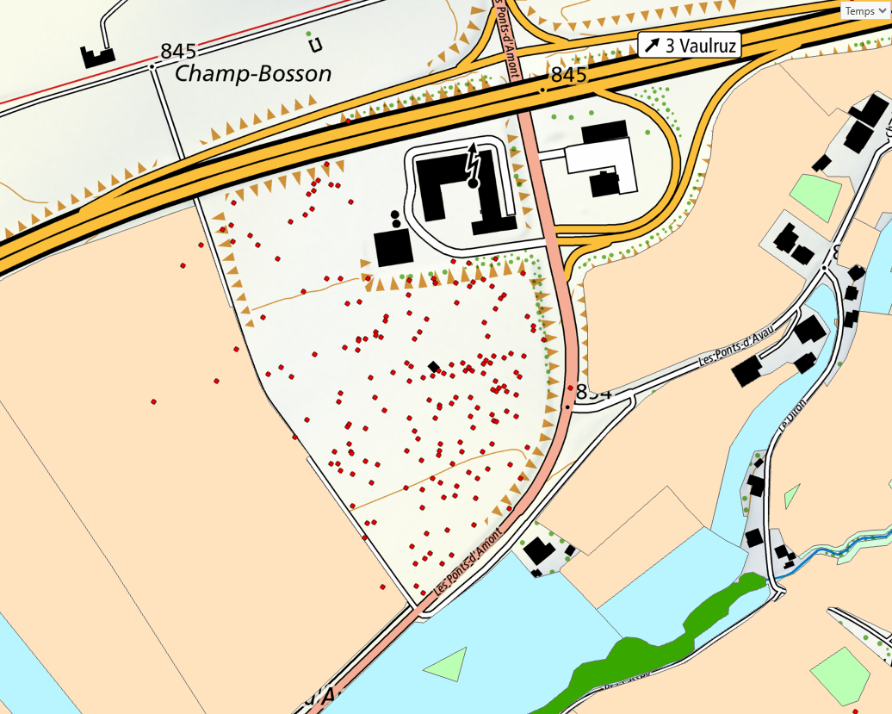

```{r, echo = FALSE}
knitr::opts_chunk$set(echo = FALSE, warning = FALSE, message = FALSE)
```

```{r}
#packages needed 
library(readr)
library(dplyr)
library(tidyr)
library(lubridate)
library(ggplot2)
library(tmap)
library(sf)
library(terra)
library(gifski)
library(sp)
library(forcats)
library(gganimate)
```

## Abstract

In September 2019, a male wild boar was captured in the pre-Alps of
Fribourg. It was equipped with a GPS collar and its movements could be
followed for almost 2 whole years. The tracking of this wild boar was
analyzed according to 4 aspects: global analysis of its movements,
analysis of important points of presence, analysis of the use of the
land cover and finally analysis of its activity patterns. The results
show a great variability both in the territory occupied and in the use
of the different covers. Hunting shows an important influence on its
general activity. The results give a direction to future analyses that
will be carried out on other individuals in the pre-Alps in order to
confirm the elements found during this project.

No studies have been conducted on the movements of wild boar in the
Pre-Alps. These analyses are done in the framework of a pre-study. The
data are the property of the state of Fribourg and must be treated
confidentially.

## Introduction and research aim

Wild boars, sus scrofa, are common mammals in Europe (Suter & Fischer,
2021). The study of their movements and habits is used in particular
within the framework of the management of their populations but also for
the prevention of damage caused to agricultural crops and epidemiology
management (Pelayo et al. 2014). Studies carried out within the
framework of the EUROBOAR network initiative have shown that wild boars
show a great behavioral plasticity and a great adaptability to their
environment. This characteristic makes the study of this species
complicated and implies that it must be studied in all environments
where it is possible to meet it (Brivio et al. 2017). Many studies have
been done to understand the spatio-temporal behavior of wild boars but
none has been published on wild boars in the Pre-Alps. The pre-Alps
present a particular territory due to their steep nature and their
landscape coverage.

In this study, the movements of a male wild boar located in the Fribourg
pre-Alps (Switzerland) were analyzed over almost two years. The first
goal of these analyses was to define the animal's home range and its use
of it. The second goal was to analyze its habits and the effect of an
anthropogenic disturbance, hunting, on its habits. As Ohashi and
colleagues did in their study in 2013, the intensity of indirect daily
disturbance caused by human activities was considered as a constant
element. As hunting occurs only some months of the year and its directed
toward wild animals, it's considered here as an temporal element that
can influence the boar's habits.

The study of this data set was done from a global analysis to a more
detailed analysis. Five elements guided the analysis with the following
questions:

-   Analysis of the general home range: where is the boar located? What
    are the movements it has made and when? Are there differences
    between seasons in its occupation of space?

-   Analysis of areas of high density of presence: did the boar stay in
    certain places for a long time or did it go back and forth? What is
    present in these areas?

-   Analysis of surface cover: what is found in this boar's home range?
    How did it use the surface cover? What is found in areas of high
    density presence?

-   Analysis of its habits: when is it most active? Are there
    differences in the use of ground cover? What is the impact of
    hunting on his habits?

-   Analysis of direct anthropogenic disturbance: How does hunting
    influence the spatiotemporal behavior of this wild boar ?

Due to the hilly topography and high elevations, the wild boar was
expected to move to higher elevations on average in the summer months
and then down in the cooler months with potential snowfall. Areas with
high density of location points are assumed to be sources of food for
this boar such as corn fields for example. Concerning the use of the
landcover by this boar, the hypothesis is an important use of forest
spaces, especially during the day, and also a variation in landcover use
depending on season as shown by Morelle and Lejeune (2015). Finally, in
view of the region where the boar is located, which is an area with many
trails and anthropogenic activities, it is assumed that the boar
presents mainly a nocturnal behavior. Hunting should have an influence
on its movements and its use of the landcover.

## Material and Methods

Spatiotemporal analysis of the data in this study was performed with
R-Studio version 2022.02.3 and ArcGis Pro version 2.8.3.

```{r}
#import the data

jojo <- read_delim("20220504_sanglier_SFN.csv", delim = ";", escape_double = FALSE, col_types = cols(Date = col_date(format = "%d.%m.%Y"), Time = col_time(format = "%H:%M:%S"), Altitude = col_number(), X = col_number(), Y = col_number()), trim_ws = TRUE)

#Some elevation points are upon 2000 which is impossible as the highest point in the region has an elevation of 2014m, therefore, all the points higher than 2000 were taken away. Same for points deeper than 600m

jojo <- jojo %>%  filter(Altitude > 500 & Altitude < 2000 )

```

### Data set

The data set used in this project comes from the Forest and Nature
Department of the canton of Fribourg. The 3rd September 2019, a male
wild boar was captured in the Fribourg pre-Alps and fitted with a GPS
collar. This collar transmitted the position of the animal every hour
from 6pm to 6am and then once at noon. The collar was programmed by the
nature and forest department based on the fact that the wild boar can be
predominantly nocturnal in areas with anthropic disturbance (Ohashi et
al., 2013 ; Podgorski et al., 2013) Location data could thus be obtained
until July 2021. The animal then suddenly disappeared and so did the GPS
transmission.

The data set contains 9431 lines, each corresponding to a location
defined by X and Y coordinates according to the Swiss coordinate system
(LV95/LV03, crs = 2056). The base file contains the following columns:

-   Date: date of the survey
-   Time: time of the survey
-   Altitude: altitude of the GPS point
-   X: X coordinate
-   Y: Y coordinate

### Preprocessing

```{r}
#tidy up the dates

m <- ymd(jojo$Date)
Monthnb <- month(m)
y <- ymd(jojo$Date)
Year <- year(y)
jojo <- mutate(jojo, Monthnb, Year)
jojo <- mutate (jojo, Month = as.character(case_when(Monthnb == 1 ~ "January", Monthnb == 2 ~ "February", Monthnb == 3 ~ "March", Monthnb == 4 ~ "April", Monthnb == 5 ~ "May", Monthnb == 6 ~ "June", Monthnb == 7 ~ "July", Monthnb == 8 ~ "August", Monthnb == 9 ~ "September", Monthnb == 10 ~ "October", Monthnb == 11 ~ "November", Monthnb == 12 ~ "December")))
jojo <- mutate(jojo, Monthyear = paste(Month,Year))
jojo$DateTime = ymd_hms(paste(jojo$Date, jojo$Time))
jojo <- mutate(jojo, Month = fct_reorder(Month, Monthnb))
```

```{r}
#Calculate Timelag, steplength and speed

X2 <- lead(jojo$X, 1)
Y2 <- lead(jojo$Y, 1)
Steplength <- sqrt((jojo$X - X2)^2 + (jojo$Y - Y2)^2)
jojo <- mutate(jojo,Timelag = as.numeric(difftime(lead(DateTime),DateTime)), Steplength)
Speed <- jojo$Steplength/jojo$Timelag #speed is in meters/minutes
jojo <- mutate(jojo, Speed)
```

```{r}
#Adding the hunting pressure
#Hunting pressure was calculated based on the official hunting periods of the canton Fribourg. Some of the hunting periods are overlaping depending on the species that can be hunted. Hunting pressure 0 is no hunting, 1 is 1 species hunted, 2 is 2 species hunted, 3 is 3 species hunted. One of the hunted species is always the wild boar. The more species can be hunted, the more people are out to hunt, what means more pressure/disturbance, even if the people are not necessarily hunting wild boars.

jojo <- mutate(jojo, Daytime = case_when(Timelag < 65 ~ "Night", Timelag > 300 ~ "Day"))
jojo <- mutate(jojo, Huntpressure = (case_when(Date >= "2019-09-01" & Date <= "2019-09-15" ~ "1", Date >= "2019-09-16" & Date <= "2019-09-27" ~ "3", Date >= "2019-09-28" & Date <= "2019-10-11" ~ "2", Date >= "2019-10-12" & Date <= "2019-10-13" ~ "1", Date >= "2019-10-14" & Date <= "2019-10-25" ~ "2", Date >= "2019-10-26" & Date <= "2019-11-01" ~ "1", Date >= "2019-11-02" & Date <= "2019-11-15" ~ "2", Date >= "2019-11-16" & Date <= "2019-12-31" ~ "1", Date >= "2020-01-01" & Date <= "2020-08-31" ~ "0", Date >= "2020-09-01" & Date <= "2020-09-15" ~ "1", Date >= "2020-09-16" & Date <= "2020-09-20" ~ "2", Date >= "2020-09-21" & Date <= "2020-10-02" ~ "3", Date >= "2020-10-03" & Date <= "2020-10-11" ~ "2", Date >= "2020-10-12" & Date <= "2020-10-18" ~ "1", Date >= "2020-10-19" & Date <= "2020-10-31" ~ "2", Date >= "2020-11-01" & Date <= "2020-11-06" ~ "1", Date >= "2020-11-07" & Date <= "2020-11-21" ~ "2", Date >= "2020-11-22" & Date <= "2020-12-31" ~ "2", Date >= "2021-01-01" & Date <= "2021-08-31" ~ "0")))
jojo <- mutate(jojo, Hunting = case_when(Huntpressure == 1 ~ "yes", Huntpressure == 2 ~ "yes", Huntpressure == 3 ~ "yes", Huntpressure == 0 ~ "no"))
```

```{r}
#isolating 2020 -> depending on the analysis, I will only use 2020 as it is the only entire year I have. 

jojo2020 <- filter(jojo, Year == 2020)
```

This data set required some additional columns derived from the base
file data to allow for further analysis to answer the questions outlined
in the introduction to this project. A first visual analysis of the file
in excel was done to observe the data.

The analysis of the "Altitude" column revealed values that could not
correspond to the region where the boar was located. Indeed, the highest
point in the region is at 2014m (Dent de Lys) and some location points
exceeded this value. These points were removed. The same was done for
the location points below 500m altitude.

```{r, fig.cap="Fig 1: Map of the studied region",fig.align='center'}
regio_map <- terra::rast("regio_map.tif")
plot(regio_map) 
```

The dates were analyzed and a subclassification by months and years was
done. These data were added as new columns to the available data. Date
and time were also merged in a new column. a "Timelag" column was
created which indicates the time elapsed between two locations, based on
the "Datetime" column created during the previous manipulation of the
"Date" and "Time" data. A "Daytime" column has been added. This one is
based on the "Timelag" column. If the time difference is less than 65
minutes, it concerns measurements taken at night (from 6pm to 6am), if
this difference is greater than 360 minutes, it concerns measurements
taken during the day (between 6am and 6pm). The column therefore
contains the information Day or Night.

To calculate the activity pattern of this boar, I decided to base my
calculations on its speed. The speed is calculated by the distance
traveled in a certain time lapse. A "Steplength" column was created.
This one indicates the distance between two rows, i.e. two location
points. Finally, a "Speed" column has been created. This one is the
result of the "Steplength" column divided by the "Timelag" column.

Finally, to analyze the influence of hunting on the activity of this
boar, two new columns were created. The first one is the hunting
pressure which was evaluated according to the number of species hunted
at the same time on a given date :

**Wild boar**

-   2019 - 01.09 until 31.12

-   2020 - 01.09 until 31.12

**Roe deer**

-   2019 - 16.09 until 12.10

-   2020 - 16.09 until 12.10

**Chamois**

-   2019 - 16.09 until 28.09

-   2020 - 21.09 until 03.10

**Deer**

-   2019 - 14.10 until 26.10 and 02.11 until 16.11

-   2020 - 19.10 until 31.10 and 07.11 until 21.11

This information was provided by the Forest and Nature Department of the
Canton of Fribourg. Based on this information, four categories were
established for hunting pressure:

-   0 - no hunting

-   1 - only wild boar hunting

-   2 - hunting of wild boar + 1 other species

-   3 - wild boar hunting + 2 other species

An additional column was created to indicate whether hunting was taking
place, based on the hunting pressure (0 = no hunting, 1/2/3 = hunting)

Some analyses could only be done with the year 2020, the only full year
of data. This is why a second data frame was created with only the
points of 2020, subset of the original data frame.

### Methods

I would like to point out that all of the methods described below can be
applied to other similar data sets. These same manipulations will be
used to study the movements of other wild boars in this same region in a
future study.

### Global analysis of the home range

Wild boars are territorial (Suter & Fischer, 2021). To understand the
extent of the male boar's territory in this study, a visual analysis of
its presence was performed. I performed a mcp derived from the location
points of this boar to identify its home range. For this purpose, the
function st_convex_hull has been applied. It takes a point cloud as
input and draws a convex hull around the most distant vertices. The area
was then calculated using the chull.area function and compared to the
results obtained on ArcGis Pro for validation. The home range was
analyzed for all the data from 2019 to 2021

The altitude at which this boar was located is an important element
considering the region in which it is located. Therefore, a boxplot
analysis was performed to see the altitude the boar was located at as a
function of the months in 2020.

### Density and path

To visualize the areas where wild boar was most often (high density of
location points), an analysis via ArcGis Pro was performed by Kernel
Density approach. Following this result, and to understand if these
areas correspond to areas where the wild boar stayed for a long time or
if it came back all the time, an analysis of the path by ggplot with the
geom_path function was performed for each month in 2020.

### Land cover and use of it

With the help of ArcGis Pro, a geopackage regrouping the data of the
departments of agriculture and forests of the canton of Fribourg for the
year 2020 has been created. Not all parcels could be assigned to a
surface category due to lack of the GIS layers. This was then imported
into R-studio. As the GIS layer contained only categories in French or
German, a column was added with the translation in English of the
different types of surfaces for a better understanding. By analyzing the
different types of surfaces and thinking about the behavior that a wild
boar could have in them, I decided to create three surface overclasses:
grassland areas which includes meadows, pastures and other rather open
surfaces, forests and finally the surfaces corresponding to woodlands
outside forests (Hedges-, fields- and riverbank woods). To facilitate
the analysis of the data, I decided to work only with the main surface
categories as well as the surface classes I created. For elements
requiring detail such as a particular field, I worked with visualization
in ArcGis Pro. The 2020 wild boar data frame and the geopackage data
were then combined into a single data frame for further analysis.

A ggplot was made to visualize the presence of wild boar on the
different terrains.

To find out the exact use of surface types by wild boar, the percentage
of location points present in each surface type was calculated. This
manipulation was then refined to identify the type of surface used
according to the time of day and according to the months.

### Activity patterns

The speed of the boar was used as a basis for analyzing its activity
rate. The GPS collar was programmed to transmit its position once an
hour during the night from 6:00 p.m. to 6:00 a.m. and then once at noon.
To verify this, two subsets were created: one for the day and one for
the night. The average of the two subsets was calculated and then they
were compared. For a better visualization, a boxplot was made. A
day/night comparison was made by boxplot according to the months in
2020.

Finally, as speed can also depend on the type of surface on which the
boar moves (behavior adapted to land cover), a boxplot analysis of the
different speeds according to the type of surface was performed.

### Effect of Hunting

Numerous studies demonstrated that hunting had an influence on boar
movement speed. To understand the influence of hunting on this male
boar, a boxplot analysis of travel speeds by hunting pressure was
performed.

To analyze whether hunting also induced a change in the boar's surface
type use patterns, the percentage of location points in a surface type
as a function of whether hunting occurred was performed.

## Results

### Home range and vertical migration

This male boar was moving in the region of the Fribourg pre-Alps. Its
home range was limited by the freeway to the west and by the Sarine
river to the east. Its home range from 2019 to 2021 was 158.97 km2.

```{r, fig.cap="Fig 2: Home range of the wild boar from september 2019 to july 2021", fig.align='center'}
#Global movement analysis, 2019-2021
jojo_sf <- st_as_sf(jojo, coords = c("X", "Y"), crs = 2056)
jojo_smry <- summarise(jojo_sf)
jojo_mcp <- st_convex_hull(jojo_smry)
df_hull2 <- jojo %>% select(X,Y)
c.hull2 <- chull(df_hull2)  #Calculates convex hull#
c.hull3 <- c(c.hull2, c.hull2[1])
chull.coords <- df_hull2[c.hull3 ,]
chull.poly <- Polygon(chull.coords, hole=F)  #From the package sp
chull.area <- chull.poly@area
#chull.area #The home range of jojo was 158968020 m2 (2019-2021)

map1 <- tm_shape(regio_map) + tm_rgb() + tm_shape(jojo_mcp) + tm_polygons(col = "orange",alpha = 0.3,border.col = "red")
map1
```

The analysis of the altitude at which the boar was located from 2019 to
2021 shows that a vertical migration to higher altitudes took place in
spring 2020 until June 2020. From July 2020 onwards, it can be observed
that the boar again descended to lower altitudes. For the rest of the
year 2020, the boar was located at approximately the same altitudes. In
2021, the boar was located within the same altitude range until July
2021 were i went up to higher altitudes (Figure 3, Table 1).

```{r, fig.cap="Fig 3: Altitude were the wild boar was, depending on the months and years", fig.align='center'}
#Analyse of elevation, 2019-2020

ggplot(data = jojo) +geom_boxplot(mapping = aes(x = Monthyear, y = Altitude), color = "indianred4") +scale_y_continuous(limits = c(400, 2000)) + xlab("Month and year") + ylab("Altitude in meters") + scale_x_discrete(limits=c("September 2019", "October 2019", "November 2019", "December 2019", "January 2020", "February 2020", "March 2020", "April 2020", "May 2020", "June 2020", "July 2020", "August 2020", "September 2020", "October 2020", "November 2020", "December 2020", "January 2021", "February 2021", "March 2021", "April 2021", "May 2021", "June 2021", "July 2021"))+ theme(axis.text.x = element_text(angle = 45, hjust = 1))
```

```{r, }
aggregate(Altitude~Monthyear, FUN = mean, data = jojo)
```

Table 1 : Mean altitude for each month between September 2019 and July
2021.

### Horizontal migration and land cover use in 2020

The point density analysis shows several areas of high density,
including one in the northwest near the highway (Figure 4). The point
analysis (Figure 5) of wild boar presence by month does not show that
wild boar remained for a long time (minimum one month) in the same area.
Path analysis by month confirms this trend, indicating that the boar was
moving back and forth within its home range (Figure 6).

```{r, fig.cap="Fig 4: Density of location points of the wild boar in 2020", fig.width=50, fig.align='center'}

```

```{r, fig.cap="Fig 5: Location points by month in 2020", fig.align='center'}
#Analyzing the points per month
ggplot(jojo2020) + geom_point(mapping = aes(X, Y, colour = Month))
```

```{r, fig.cap="Fig 6: Path analysis by month in 2020", fig.align='center'}
#Analyzing path, 2020
ggplot(jojo2020, aes(X, Y)) + geom_path(show.legend = FALSE, color = "indianred4") + facet_wrap (~ Month)
```

All the analyses carried out concerning the use of the different types
of surface show that the wild boar was mainly located in the forest. Its
presence in the forest did not vary much between months. Its presence in
summer pastures was more important in May, June and July 2020 than in
the other months. In January 2020, about 20% of the wild boar were in
areas not identified in the available geopackage compared to 10% in
December 2020 (Figure 7). The location points in 2020 were located this
way : 50.5% Forest, 35.7% Grassland, 0,3% Hedges-, fields- and riverbank
woods, 13,5% NA.

```{r, fig.cap="Fig 7: Land cover use per month in 2020.", fig.align='center'}
#Land cover analysis : what is where and where was the wild boar, 2020

jojo_sf2020 <- st_as_sf(jojo2020, coords = c("X", "Y"), crs = 2056)


land_cover <- read_sf("land_cover.gpkg")

#head(land_cover)

#summary(land_cover)

land_cover <- mutate (land_cover, Landcover = as.factor(case_when(HAUPTKATEGORIE_DE == "Streueflächen" ~ "Litter surfaces", HAUPTKATEGORIE_DE == "Hecken-, Feld- und Ufergehölze" ~ "Hedges, fields and riverbank woods", HAUPTKATEGORIE_DE == "Baum, überlagernd Fläche" ~ "Tree, overlaying areas", HAUPTKATEGORIE_DE == "Dauerweiden" ~ "Permanent pastures", HAUPTKATEGORIE_DE == "Dauerwiesen" ~ "Permanent meadows", HAUPTKATEGORIE_DE == "Sömmerungsfläche" ~ "Summer pastures", HAUPTKATEGORIE_DE == "Wald" ~ "Forests", HAUPTKATEGORIE_DE == "Ackerfläche" ~"Cropland", HAUPTKATEGORIE_DE == "Flächen ausserhalb der LN" ~ "Areas outside LN", HAUPTKATEGORIE_DE == "Übrige Flächen innerhalb der LN" ~ "Other areas inside LN")))

land_cover <- mutate (land_cover, Maincover = as.factor(case_when(HAUPTKATEGORIE_DE == "Streueflächen" ~ "Grassland areas", HAUPTKATEGORIE_DE == "Hecken-, Feld- und Ufergehölze" ~ "Hedges, field and riverbank woods", HAUPTKATEGORIE_DE == "Baum, überlagernd Fläche" ~ "Grassland areas", HAUPTKATEGORIE_DE == "Dauerweiden" ~ "Grassland areas", HAUPTKATEGORIE_DE == "Dauerwiesen" ~ "Grassland areas", HAUPTKATEGORIE_DE == "Sömmerungsfläche" ~ "Grassland areas", HAUPTKATEGORIE_DE == "Wald" ~ "Forest", HAUPTKATEGORIE_DE == "Ackerfläche" ~"Grassland areas", HAUPTKATEGORIE_DE == "Flächen ausserhalb der LN" ~ "Grassland areas", HAUPTKATEGORIE_DE == "Übrige Flächen innerhalb der LN" ~ "Grassland areas")))


#unique(land_cover$Landcover)

#ggplot(land_cover) + geom_sf(aes(fill = Landcover)) + scale_fill_brewer(palette = "Paired")

#ggplot(land_cover) + geom_sf(aes(fill = Landcover)) + scale_fill_brewer(palette = "Paired") + geom_sf(data=jojo_sf2020, color = "darkorange", show.legend = FALSE)

#ggplot(land_cover) + geom_sf(aes(fill = Maincover)) + scale_fill_brewer(palette = "YlGn")

#ggplot(land_cover) + geom_sf(aes(fill = Maincover)) + scale_fill_brewer(palette = "YlGn") + geom_sf(data=jojo_sf2020, color = "darkorange", show.legend = FALSE)


#Land cover use, 2020

jojo_join <- st_join(jojo_sf2020, land_cover)

#Main cover use per month

jojo_maincover <- jojo_join %>% st_set_geometry(NULL) %>% mutate(Month, Maincover) %>% group_by(Month, Maincover) %>% count() %>% ungroup %>% group_by(Month) %>%  mutate(Percentage = n/sum(n)) %>% ungroup() %>% mutate(Maincover = fct_reorder(Maincover, n, sum, desc = TRUE))


#ggplot(na.omit(jojo_maincover), aes(Month, Percentage, fill = Maincover)) + geom_col(width = 0.3) + theme_gray() + labs(title = "Use of land cover per Month", subtitle = "Only showing the most common categories") + scale_x_discrete(limits=c("January", "February", "March", "April", "May", "June", "July", "August", "September", "October", "November", "December")) + geom_bar(aes(Month, Percentage, fill= Maincover), colour="black", stat="identity") + theme(axis.text.x = element_text(angle = 45, hjust = 1)) + scale_fill_brewer(palette = "YlGn")

#aggregate(Percentage ~ Maincover, FUN=mean, data = jojo_maincover) # 50.5% Forest, 35.7% Grassland, 0,3% Hedges


#Detailed cover use per month

jojo_landcover <- jojo_join %>% st_set_geometry(NULL) %>% mutate(Month, Landcover) %>% group_by(Month, Landcover) %>% count() %>% ungroup %>% group_by(Month) %>%  mutate(Percentage = n/sum(n)) %>% ungroup() %>% mutate (Landcover = fct_reorder(Landcover, n, sum, desc = TRUE))


ggplot(na.omit(jojo_landcover), aes(Month, Percentage, fill = Landcover)) + geom_col(width = 0.3) + theme_gray() + scale_x_discrete(limits=c("January", "February", "March", "April", "May", "June", "July", "August", "September", "October", "November", "December")) + geom_bar(aes(Month, Percentage, fill= Landcover), colour="black", stat="identity") + theme(axis.text.x = element_text(angle = 45, hjust = 1)) + scale_fill_brewer(palette = "YlGn")

#aggregate(Percentage ~ Landcover, FUN=mean, data = jojo_landcover) 
# 50.5% Forest, 23.7% Summer pastures, 7.7% Permanent meadows, 4.1% Permanent pastures, 0.4% Tree, overlaying areas, 0.3% Hedges, 0.2% Litter surfaces
```

The wild boar was primarily located in the forest during the day
(between 6:00 am and 6:00 pm) and diversified the areas where they were
located at night (Figure 8).

```{r, fig.cap="Fig 8: Land cover use depending on daytime for each month in 2020", fig.align='center'}
#Main land cover use depending on day time and month, 2020

jojo_mc_daytime <- jojo_join %>% st_set_geometry(NULL) %>% mutate(Month, Daytime, Maincover) %>% group_by(Month,Daytime, Maincover) %>% count() %>% ungroup %>% group_by(Month, Daytime) %>%  mutate(Percentage = n/sum(n)) %>% ungroup() %>% mutate(Maincover = fct_reorder(Maincover, n, sum, desc = TRUE))

ggplot(na.omit(jojo_mc_daytime), aes(Daytime, Percentage, fill = Maincover)) + geom_col(width = 0.3) + facet_wrap (~ Month) + geom_bar(aes(Daytime, Percentage, fill= Maincover), colour="black", stat="identity") + scale_fill_brewer(palette = "YlGn")
```

An analysis on ArcGis Pro of areas with many location points showed that
the GIS layer provided by the department for agriculture did not
identify all areas (Figure 9).

```{r, fig.cap="Fig 9: Some location points could not be attributed to a specific land cover with the provided GIS layer", fig.width=50, fig.align='center'}

```

### Activity patterns

The speed of the boar does not show a big visual difference from month
to month (Figure 10). It averages 0.64 m/min during the day (6am to 6pm)
and 5.04 m/min at night (6pm to 6am).

```{r}
#Analyse of activity patterns, based on the speed (in meters/minute), 2019-2021

#summary(jojo)
#All websites i found say that maximal speed for a wildboar is about 40 km/h. In our case, the max speed is 55 m/min = 3.3 km/h. Therefore, there is no correction of the data. We also don't have any negative values

#Speed depending on daytime and month

jojo_day <- subset(jojo, Daytime == "Day", select=c(X, Y, Date, Time, Timelag, Steplength, Speed, Huntpressure, Hunting))
jojo_night <- subset(jojo, Daytime == "Night", select=c(X, Y, Date, Time, Timelag, Steplength, Speed, Huntpressure, Hunting))
#summary(jojo_day) #mean speed = 0.64 m/min
#summary(jojo_night) #mean speed = 5.04 m/min 

#ggplot(na.omit(jojo)) + geom_boxplot(mapping = aes(Daytime, Speed), color = "indianred4") + scale_y_continuous(limits = c(0, 30)) + ggtitle("Speed depending on Daytime") + xlab("Daytime") + ylab("Speed in m/min")
```

```{r, fig.cap="Fig 10: Speed depending on daytime for each month in 2020", fig.align='center'}
ggplot(na.omit(jojo)) +geom_boxplot(mapping = aes(x = Daytime, y = Speed), color = "indianred4") +scale_y_continuous(limits = c(0, 30)) + ggtitle("Speed depending on Daytime per Month") + xlab("Month") + ylab("Speed in m/min") + facet_wrap(~Month)
```

The boar moved slower on average in the forest than in other surface
types except for litter surfaces (Table 2).

```{r}
#Speed depending on land cover use, 2020

#ggplot(na.omit(jojo_join)) + geom_boxplot(mapping = aes(x = Landcover, y = Speed), color = "indianred4") + scale_y_continuous(limits = c(0,30)) + scale_x_discrete(limits = c("Forests", "Permanent meadows", "Permanent pastures", "Summer pastures", "Tree, overlaying areas", "Hedges, fields and riverbank woods")) + ggtitle("Speed depending on Landcover") + xlab("Landcover") + ylab("Speed in m/min")+ theme(axis.text.x = element_text(angle = 45, hjust = 1))

aggregate(Speed ~ Landcover, FUN=mean, data = jojo_join)
```

Table 2 : Mean speed for each landcover category in 2020.

### 

### Effect of hunting

Boxplot results show greater forest use during the hunting season in
2020 (Figure 11). Grassland use is similar between periods.

```{r, fig.cap="Fig 11: Landcover use depending on hunting in 2020", fig.align='center'}
#Main land cover use depending on hunting, 2020

jojo_mc_hunting <- jojo_join %>% st_set_geometry(NULL) %>% mutate(Hunting, Maincover) %>% group_by(Hunting, Maincover) %>% count() %>% ungroup %>% group_by(Hunting) %>%  mutate(Percentage = n/sum(n)) %>% ungroup() %>% mutate(Maincover = fct_reorder(Maincover, n, sum, desc = TRUE))

ggplot(na.omit(jojo_mc_hunting), aes(Hunting, Percentage, fill = Maincover)) + geom_col(width = 0.3) + geom_bar(aes(Hunting, Percentage, fill= Maincover), colour="black", stat="identity") + scale_fill_brewer(palette = "YlGn")
```

The boxplots show an increase in velocity when hunting pressure is
present compared to a period without hunting (Figure 12). The mean of
speed increased during the day and during the night with hunting
pressure (Table 3, Table 4).

```{r, fig.cap="Fig 12: Speed depending on the hunting pressure from 2019 to 2021", fig.align='center'}
#Speed depending on hunting pressure

ggplot(data = jojo) + geom_boxplot(mapping = aes(x = Huntpressure, y = Speed), color = "indianred4") + scale_y_continuous(limits = c(0,30)) + xlab("Hunting pressure") + ylab("Speed in m/min") + scale_x_discrete(limits=c("0", "1", "2", "3"))
```

```{r}
aggregate(Speed ~ Huntpressure, FUN=mean, data = jojo_day)
```

Table 3 : Mean speed during day depending on hunting pressure from 2019
to 2021.

```{r}
aggregate(Speed ~ Huntpressure, FUN=mean, data = jojo_night)
```

Table 4 : Mean speed during night depending on hunting pressure from
2019 to 2021.

## Discussion

**Home range and vertical migration**

The study of the movements of the wild boar in this study allowed a
better understanding of its habits, its use of the land cover and the
influence of the hunt on its spatial behavior. The data collected with
the GPS collar allowed the study of its vertical and horizontal
migration as well as the visualization of its home range. The results
show that the boar in this study had a territory of 158.67 km2 which is
about five times larger than the territories recorded for male boars
which range from 4.5 to 30 km2 (Suter & Fischer, 2021). This difference
could be explained by the hilly topography of the home range of this
boar. Studies on other wild boars in the same region would allow us to
establish whether this is an isolated case linked to this individual or
a generalization for the Pre-Alps region.

One of the hypotheses of this study was to imagine a migration of wild
boar to lower altitudes during the bad season because of the weather
conditions and the possible difficulty to find food at higher altitudes
in winter. The results showed a slight migration to higher elevations in
spring and early summer of 2020 and then a return to elevations around
1000m. This trend was not repeated for the year 2021, except for a large
ascent in July 2021.

One explanation for this would be the sometimes more difficult access at
higher altitudes. Moreover, the Moléson and Dent de Lys regions are very
popular hiking areas, making the higher altitudes no more interesting
from a tranquility point of view than the areas where the wild boar were
found most of the time. Furthermore, forest cover decreases with
elevation. Since the wild boar observed here was mainly located in
forests, the lack of forest cover towards higher elevations could also
be an explanation for the limits of the animal's vertical migration. The
years studied may have had meteorological characteristics that could
have influenced the movements of the boar. However, these were not
investigated in these analyses. Further analysis of the weather
conditions during the years of observation may provide more accurate
answers to the question of whether wild boar move to certain elevations
rather than others.

**Horizontal migration and land cover use**

Tracking analysis of the boar in this study showed that the animal was
regularly traveling back and forth within its home range. Some
geographic points seemed to be more popular than others and the analysis
of the density of the location points clearly shows a geographic area
particularly appreciated by the animal (Figure 4). Analysis of the GIS
layer of surface cover compared with the location points was not
sufficient in this study to explain all the location points. When the
data was collected, the local wildlife ranger was asked to visit some of
the plots to see what was there. For example, it appears that corn plots
are not included in the GIS layer, but were particularly popular for
this wild boar (Figure 9). Much of the data is thus biased because these
types of plots fall into the NA category (about 13.5%) of our analysis
and only an on-site analysis could answer questions related to these
presence points. This indicates the limitation of the technique used in
this study.

The boar in this study spent half of its time in the forest in 2020.
This is consistent with data collected in other studies and in the
general literature (Suter & Fischer, 2021). In 1991, Gerard et al.
described that wild boar in their study in agricultural areas showed a
tendency to move from their usual habitat areas to new areas between
March and July. The results obtained in this study show a similar trend.
In June 2020, the wild boar observed used less forest habitat than in
other months of the year and increased its use of other areas. From
March to July, plant growth is significant and moving to agricultural
land provides an energetic advantage to the animals (Rosell et al.
2012). These larger out-of-forest excursions during this period could
therefore have provided a clear advantage to the boar observed in this
study. However, these results must be put into perspective as from May
to July 2020, this boar also moved to higher elevations where there is
less forest cover.

During 2020, the wild boar was primarily located in the forest during
the day and exited onto other surface types during the night hours. The
forest provides hiding places and allows the animal to rest in safety
during day. This correlates with the results of Gerard et al. (1991) who
showed that natural habitats are more favored during resting times than
during activity phases.

**Activity patterns**

The boar showed an important nocturnal activity throughout the year and
never reversed its daily rhythm. This nocturnal activity has also been
noted in other studies and has been related to the greater anthropogenic
disturbance during the day, forcing the animal to adapt (Ohashi et al.
2013; Podgorski et al. 2013). The results of this study are consistent
with this trend. Indeed, the lower elevation areas are often close to
dwellings and the area in general is a popular tourist area in both
winter and summer, implying regular anthropogenic disturbance regardless
of the season.

The type of surface in which the animal moved could potentially
influence its activity. In general, wild boar moved slower on average in
forests than in grassy areas. This can be explained by the day/night
bias, as the boar most likely used forest areas for resting, but also by
the denser vegetation that made movement more difficult. On the other
hand, this could also be explained by the insecurity linked to open
areas, forcing the animal to move more quickly in grassy areas.

**Effect of hunting**

Analyses of other publications could not show a trend in the influence
of hunting on overall boar activity. In 2008, Keuling et al. and Ohashi
et al. observed an increase in nocturnal activity during hunting. In
2013, Thurfjell et al. showed, on the contrary, a decrease in nocturnal
activity during the hunting season. Brivio et al. (2017), on the other
hand, observed no difference in nighttime activity of wild boars during
the hunting season in their study. The main difference between these
studies included the study region. In our study in the Fribourg
pre-Alps, the overall day and night activity of wild boar increased with
hunting pressure. The more species were hunted at the same time, the
more hunters were present in the field. This pressure was reflected in
the activity of this boar, indicating very clearly the disturbance
caused to the fauna by the presence of these hunters, even if they were
not looking for the boar. However, the results of this study do not show
an increase in boar activity proportional to hunting pressure. In fact,
hunting pressure category 3 indicates less disturbance than hunting
pressure category 2. This result must be put into perspective because
hunting pressure category 3 only concerns 2 weeks per year. In this
study, this represents 4 weeks spread over almost 2 years of monitoring,
implying a bias in the results. It might be appropriate to limit the
number of hunting pressure categories to 3 instead of 4 in order to
remove this bias.

Hunting can cause space use to be altered from its normal use
(Scillitani et al. 2020). In this study, wild boar appeared to have
increased use of forested areas during hunting. This result cannot be
considered absolute. Indeed, the analysis of the GIS layer showed that a
part of the parcels could not be attributed and are considered as NA.
The wildlife warden indicated at the time that some of these plots
contained corn and other crops. The hunting season is from September to
December. During this period, migration to forested areas was described
in other studies (Ballari et al. 2013 ; Massei et al. 1996) and
migration to agricultural land occurs in the spring and summer, i.e.
during the non-hunting period. The number of unallocated plots is
increased in the non-hunting period, corresponding to the spring and
summer months. Therefore, the migration to forested areas from September
to December 2020 cannot be attributed solely to hunting pressure. 

## Conclusion

The spatiotemporal use that an animal makes depends on many intrinsic
and extra-intrinsic reasons. This study did not cover all possible
aspects and further study would be needed to further understand this
individual's movements and motivations.

These results were validated by personal visualization and comparison
with elements found in publications. Some answers were provided by
discussion with the wildlife ranger of the region. A detailed
statistical analysis is necessary to be able to affirm if the trends
observed on the obtained graphs are significant or not. This analysis
will be carried out in a second time, outside the framework of this
work.

Finally, this study should be seen as a pre-study. Indeed, the study of
a single individual does not allow us to draw conclusions for the local
population, but it does allow us to determine in which direction further
research could go in a study with more individuals.

## References

Ballari S.A. & Barrios-Garcia M.N. (2013) : A review of wild boar Sus
scrofa diet and factors affecting food selection in native and
introduced ranges. Mammal Rev 44: 124-134. DOI : 10.1111/mam.12015

Brivio F., Grignolio S., Brogi R., Benazzi M., Bertolucci C. & Apollonio
M. (2017) : An analysis of intrinsic and extrinsic factors affecting the
activity of a nocturnal species : The wild boar. Mammalian Biology 84:
73-81.

Gerard J-F., Cargnelutti, Spitz F., Valet G. & Sardin T. (1991) :
Habitat use of wild boar in a French agroecosystem from late winter to
early summer. Acta theriologica 36 (1-2): 119-129.

Johann F., Handschuh M., Linderoth P., Heurich M., Dormann C.F. & Arnold
J. (2020) : Variability of daily space use in wild boar Sus scrofa.
Wildlife Biology. DOI : 10.2981/wlb.00609

Keuling O., Stier N. & Roth M. (2008) : How does hunting influence
activity and spatial usage in wild boar Sus scrofa L. ? Eur. J. Wildl.
Res 54: 729-737.

Massei G., Genov P.V. & Staines B.W. (1996) : Diet, food availability
and reproduction of wild boar in a Meditterranean coastal area. Acta
Theriol 41:307-320.

Morelle K. & Lejeune P. (2015) : Seasonal variations of wild boar Sus
scrofa distribution in agricultural landscapes : a species distribution
modelling approach. Eur. J. Wildl. Res. 61: 45-56.

Ohashi H. et al. (2013) : Differences in the activity pattern of the
wild boar Sus scrofa related to human disturbance. Eur J. Wildl Res 59:
167-177.

Pelayo A., Quiros-Fernandez F., Casal J. & Vicente J. (2014) : Spatial
distribution fo wild boar population abundance : Basic information for
spatial epidemilogy and wildlife management. Ecological Indicators 36 :
594-600.

Podgorski T., Bas G., Jedrzejewska B., Sönnichsen L., Sniezko S.,
Jedrzejewski W. & Okarma H. (2013) : Spatiotemporal behavioral
plasticity of wild boar (Sus scrofa) under contrasting conditions of
human pressure : primeval forest and metropolitan area. J. Mammal. 94:
109-119.

Rosell C., Navas F. & Romero S. (2012) : Reproduction of wild boar in a
cropland and coastal wetland area : implications for management. Anim
Biodivers Conserv 35: 209-2017.

Scillitani L. et al. (2010) : Do intensive drive hunts affect wild boar
(Sus scrofa) spatial behaviour in Italy ? Some evidences and management
implications. Eur. J. Wildl. Res. 56: 307-318.

Suter S.M & Fischer C. (2021) : Wildschwein, p .316-139 in : Graf R.F. &
Fischer C. (2021): Atlas der Säugetiere. Schweiz und Liechtenstein.
Schweizerische Gesellschaft für Wildtierbiologie SGW, Haupt Verlag,
Bern.

Thurfjell H., Spong G. & Ericsson G. (2013) : Effects of hunting on wild
boar Sus scrofa behaviour. Wildlife Biology 19: 87-93.

## Appendix :

#### Supplement R-Code

```{r}
knitr::opts_chunk$set(eval = FALSE)
```

```{r, eval = FALSE, echo = TRUE}
#Analyzing path in 2020 in a more funny way 

p <- ggplot(jojo2020, aes(X, Y)) + geom_path(show.legend = FALSE, mapping = aes(color = "indianred4")) + transition_time(Date) + labs(title = "Date : {frame_time}")
path2020 <- animate(p, duration = 120, render = gifski_renderer())
anim_save("jojo_path2020.gif", path2020)
```
